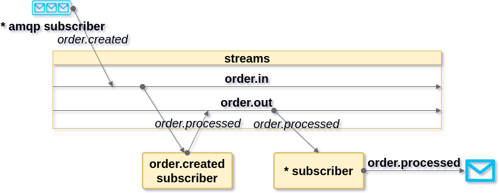

# RxJS-RabbitMQ-streams
> The purpose of this POC is to use RxJS as an interface to RabbitMQ

The curiosity/necessity of use rabbitmq without coupling my code with it took me to study an possible flow to connect it with ReactiveX.

So this is my try.

## First approach

Have only one amqp subscriber producing to RxJS subjects and the rx-subscriber itself send messages to MQ.

### Pros
   - low complexity
### Cons
   - medium coupled
   - possible message overload
   
## Second approach

Have only one amqp subscriber producing and two rx subjects, one for incoming messages and one for send messages to MQ.

### Pros
   - low complexity
   - low coupled
### Cons
   - no semantic
   - no intuitive
   - output stream will have at most one subscriber with the responsability to send to MQ.

## Third approach

Have one amqp subscriber by routing key. The output can be any of the above solutions.

### Pros
   - receive only what my app knows how to awnser
   - no message overload
### Cons
   - responsability duplicity
   - medium coupled

## Roadmap

* Add an image with the proposed flow to README.md

## Release History

* 0.0.1
    * Work in progress

## Meta

Alex Rocha - [about.me](http://about.me/alex.rochas)
